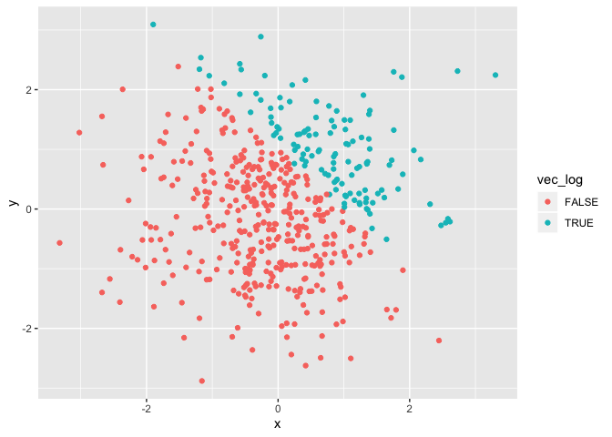
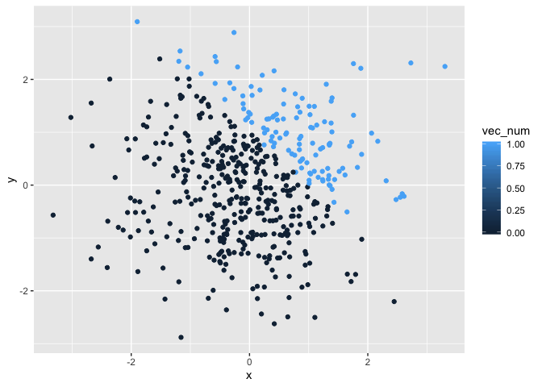

p8105\_hw1\_bw2595
================
Blair Wigsten
9/17/2019

# Problem 1

## Load tidyverse and create the logical, character, and factor vectors within the dataframe

``` r
library(tidyverse)
```

    ## ── Attaching packages ─────────────────────────────────────────────────────────── tidyverse 1.2.1 ──

    ## ✔ ggplot2 3.2.1     ✔ purrr   0.3.2
    ## ✔ tibble  2.1.3     ✔ dplyr   0.8.3
    ## ✔ tidyr   0.8.3     ✔ stringr 1.4.0
    ## ✔ readr   1.3.1     ✔ forcats 0.4.0

    ## ── Conflicts ────────────────────────────────────────────────────────────── tidyverse_conflicts() ──
    ## ✖ dplyr::filter() masks stats::filter()
    ## ✖ dplyr::lag()    masks stats::lag()

``` r
set.seed(100)

hw1q1_df = tibble(
  norm_samp = rnorm(8),
  vec_logical = c(norm_samp > 0),
  vec_char = c("A", "B", "C", "D", "E", "F", "G", "H"),
  vec_fac = factor(c("low", "med", "high", "low", "med", "high", "low", "med"))
)
```

## Try to take the mean of each variable in the dataframe

``` r
mean(pull(hw1q1_df, norm_samp))
```

    ## [1] 0.1256937

``` r
mean(pull(hw1q1_df, vec_logical))
```

    ## [1] 0.625

``` r
mean(pull(hw1q1_df, vec_char))
```

    ## Warning in mean.default(pull(hw1q1_df, vec_char)): argument is not numeric
    ## or logical: returning NA

    ## [1] NA

``` r
mean(pull(hw1q1_df, vec_fac))
```

    ## Warning in mean.default(pull(hw1q1_df, vec_fac)): argument is not numeric
    ## or logical: returning NA

    ## [1] NA

### Only the first 2 variables have a mean value outputted. We cannot take the mean of a character or factor variable, so we get an error that the argument is not numeric or logical.

## Apply as.numeric function to our logical, character, and factor vectors

``` r
as.numeric(pull(hw1q1_df, vec_logical))
```

    ## [1] 0 1 0 1 1 1 0 1

``` r
as.numeric(pull(hw1q1_df, vec_char))
```

    ## Warning: NAs introduced by coercion

    ## [1] NA NA NA NA NA NA NA NA

``` r
as.numeric(pull(hw1q1_df, vec_fac))
```

    ## [1] 2 3 1 2 3 1 2 3

### When we do this, we get number values for our logical and factor variables, so we could take the mean here. But since the character vector does not connect to numbers, we cannot convert to numeric and are given the “NAs introduced by coercion” error.

## Converting vectors

``` r
#convert the logical vector to numeric, and multiply the random sample by the result
as.numeric(pull(hw1q1_df, vec_logical)) * pull(hw1q1_df, norm_samp)

#convert the logical vector to a factor, and multiply the random sample by the result
as.factor(pull(hw1q1_df, vec_logical)) * pull(hw1q1_df, norm_samp)

#You cannot multiply a factor vector?

#convert the logical vector to a factor and then convert the result to numeric, and multiply the random sample by the result
a = as.factor(pull(hw1q1_df, vec_logical)) 
as.numeric(a)*pull(hw1q1_df, norm_samp)
```

# Problem 2

## Creating a dataframe

``` r
set.seed(100)

hw1q2_df = tibble(
  x = rnorm(500),
  y = rnorm(500),
  vec_log = c(x + y > 1), 
  vec_num = as.numeric(vec_log),
  vec_fac = as.factor(vec_log)
)
```

## Inline code describing the data

There are 500 rows in the dataframe and 5 columns. The mean value of x
is -0.0376074, the median value of x is -0.0600876, and the standard
deviation of x is 1.0049216. The proportion of cases for which x + y \>
1 is 0.242

## Create scatterplots of logical, numeric, and factor vectors

``` r
ggplot(hw1q2_df, aes(x = x, y = y, color = vec_log)) + geom_point()
```

<!-- -->

``` r
ggsave("scatter_plot.pdf", height = 6, width = 6)

ggplot(hw1q2_df, aes(x = x, y = y, color = vec_num)) + geom_point()
```

<!-- -->

``` r
ggplot(hw1q2_df, aes(x = x, y = y, color = vec_fac)) + geom_point()
```

<!-- -->
